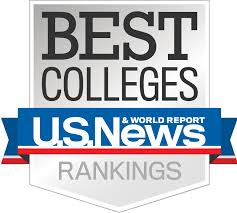

 

# Step-by-step guide to full-ride scholarship in the U.S.

***

		Marketing Content for Mentor
		 
		
		 
		<b>Subscribe here for more</b>
		 

***

***

<h3 align="center"><strong>Purpose of this Roadmaps</strong></h3>

> The purpose of this roadmap is to give you actionable steps on how to approach a U.S. college hunt. This is based solely on my experience as a former student in your shoe myself and as a former admission officer at ABC college.

<h3 align="center"><strong>Note to Parents</strong></h3>

> If you are a parent and looking for directions on how to prepare your kids for studying abroad, you can either skip to [here](#) or follow this [roadmap](#) instead. 

***

## Step 1: Define your study aboard goals

1. What are you looking for in a college/university?
    This first step is extremely crucial as parents and students usually get carried away with grades and monetary costs and whatever everyone else is doing, rather than asking themselves what it is that they are looking for.

    Take a step back, ask yourselves these questions. Then we will carry on to step 2 to 
    [Four Important Things to Consider When Choosing A College](#)

2. Liberal Arts vs. University
    There are two types of colleges in the United States, one of which provides much more support for need-based financial aid to its students. Please follow this [link](#) to understand more about their strengths and differences.

    Once you have a rough idea of which type of college is a better fit for you. Continue on to the next step! 

## Step 2: Select your schools

1. Pick your top schools
    
    Take a look at this list [Best Colleges](https://www.usnews.com/best-colleges) to find the top schools of your choice. Remember to align it with your priorities in Step 1!

2. Pick your reach schools
    
    It doesn't hurt to always dream high! This is exactly why I made this roadmap and why you are following this platform, aren't you!? Again, let's remind ourselves that the best schools are not necessarily the ones with the highest test score requirements. They are ones that align with your priorities but maybe your goals haven't necessarily matched with their standards yet.

3. Pick your safety schools
    
    This will be safety net in case you might have been rejected or you might not have scored the amount of scholarship you expected. These are the schools that will both give you a great education but not empty your pockets!

## Step 3: Standardized Tests

1. TOEFL
2. SAT vs ACT

## Step 4: Extracurriculars
1. What are they?
2. Minimum number of hours per week

## Step 5: Application

1. How to write an effective personal essay
2. Why you need recommendation letters

## 🚦 Wrap Up

If you think any of the steps can be improved, feel free to discuss it in the comments. Also, I will continue to improve this, so you might want to watch click on `Get Started` and follow this roadmap.

## Mentorship

If you are interested in mentorship sessions please leave a message or email (duhocsinhmy@gmail.com) for more information. COACHING IS NOT FREE.

